## What You'll Learn
This workshop is a 75-90 minute introduction to ASP.NET Core 2.1. It begins with a quick overview of ASP.NET Core fundamentals (including tools and solution structure). It then digs into some specific ASP.NET Core 2.1 features, with a deep dive into real-time communications with SignalR.

 * Getting started with ASP.NET Core
     * Creating a new ASP.NET Core application
     * Understanding how ASP.NET Core source code is organized
 * Razor Pages
 * New Features in the ASP.NET Core 2.1 release
 * Feature overview
    * HTTPS
    * GDPR
    * Identity UI as a library
    * HttpClientFactory
 * SignaR: real-time communications for ASP.NET Core
    * Getting started
    * Exploring an advanced SignalR Sample Application

## Prerequisites
  1. .NET Core SDK (version 2.1.300-preview1 or higher) [[download](https://www.microsoft.com/net/download)]
  2. Visual Studio *or* Visual Studio Code (latest public release) [[download](https://www.visualstudio.com/)] 

## Setup
>  Note: For BUILD Instructor Led Labs, all setup steps have been completed on the lab virtual machine.

---

## Exercises

1. [Getting Started](#Exercise1)
1. [Razor Pages](#Exercise2)
1. [ASP.NET Core 2.1 Features](#Exercise3)
1. [SignalR](#Exercise4)

<a name="Exercise1" ></a>
### Exercise 1: Getting Started with ASP.NET Core ###

1. Tools overview by instructor(2 minutes)
    1. SDK
    2. CLI
    2. Visual Studio Code
    3. Visual Studio

    >Note: The instructor will give a quick overview of the tools from slides and dot.net website.
2. File / New Project
    1. Open Visual Studio 2017 and select File / New Project from the menu.
    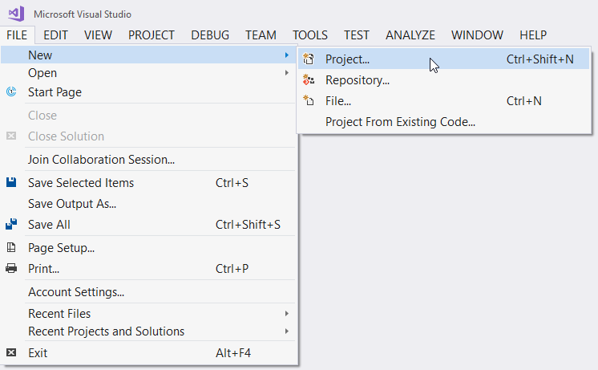
    2. Select **Visual C#** / **.NET Core** / **ASP.NET Core Web Application** as the project type. Pick a name for the application (e.g. *Build2018*) and press **OK**.
    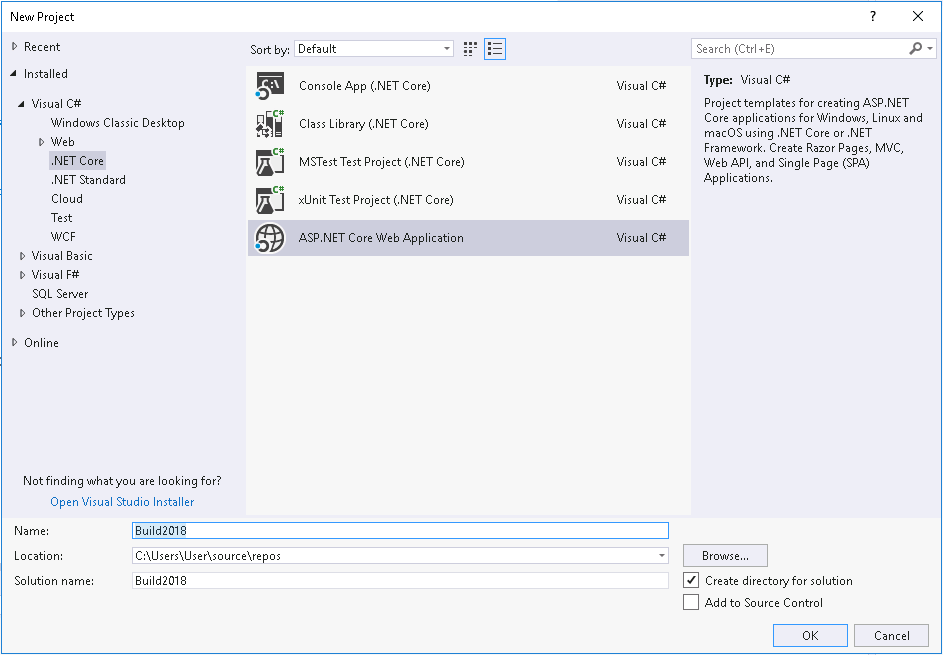
    3. Ensure **ASP.NET Core 2.1** is selected at the top of the project options dialog. Select **Web Application**. 
    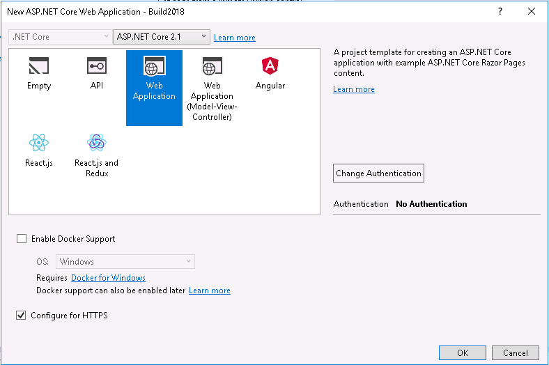
    4. Click on the **Change Authentication** and select **Individual User Accounts**.
    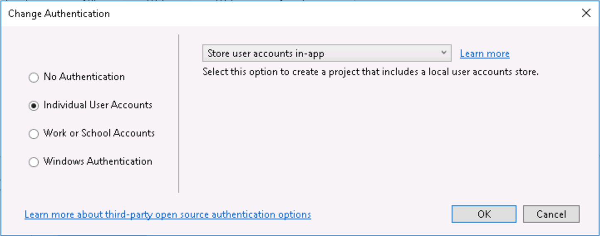 
    5. Press **OK** on the **Authentication Options** dialog and on the new project dialog.

3. Solution overview
    1. Program.cs
    
        Open the `Program.cs` file in the root of the project. An ASP.NET Core Application is a console application that creates its own web server in the [`Main`](https://docs.microsoft.com/en-us/aspnet/core/fundamentals/?tabs=aspnetcore2x) method. The `Program.cs` code is short and generic, as the application specific code is placed in a separate `Startup` class.
    2. Startup.cs

        The [`Startup`](https://docs.microsoft.com/en-us/aspnet/core/fundamentals/startup) class prepares the the web application to start by configuring services and the app's request pipeline.
        
        >Note: If you have worked with previous versions of ASP.NET, you've configured applications using a combination of C# code (in `global.asax`) and XML (in `web.config`). In ASP.NET Core, the application's configuration is code-based, giving you much more control: you can debug it, add conditional logic, etc.
    3. Pages
        1. Home
        
            Expand the `Pages` folder and open the `Index.cshtml` file. This is the home page of the site, built using Razor Pages. Razor Pages is a new feature of ASP.NET Core MVC that makes coding page-focused scenarios easier and more productive.
            
            >Note: If you have previously used ASP.NET MVC, you'll notice a lot of similarities and a few differences. Razor Pages are an abstraction that is built on top of ASP.NET MVC. It allows for a page focused web development model, with a backing page model class and methods that map to HTTP verbs, like `OnGet` and `OnPost`. However, the view code is similar to MVC views, and is written using Razor syntax.
        2. Layout
        
            Open the `Pages\Shared\_Layout.cshtml` file. This layout defines common page elements, such as page headers and footers.
4. Run the application

    1. Run the application by pressing `Ctrl+F5` or using the *Debug* | *Start Without Debugging* menu in Visual Studio.
    2. You will be prompted to install a certificate to support HTTPS development on localhost as shown in the images below. Click **Yes** on both prompts. 

        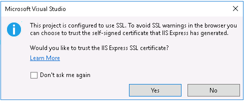
        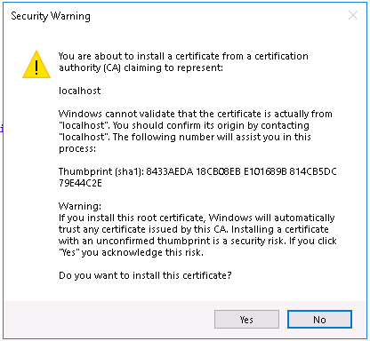
    
    3. Next, you will see a message indicating that dabase migrations need to be as shown below. Click the **Apply Migrations** button.

        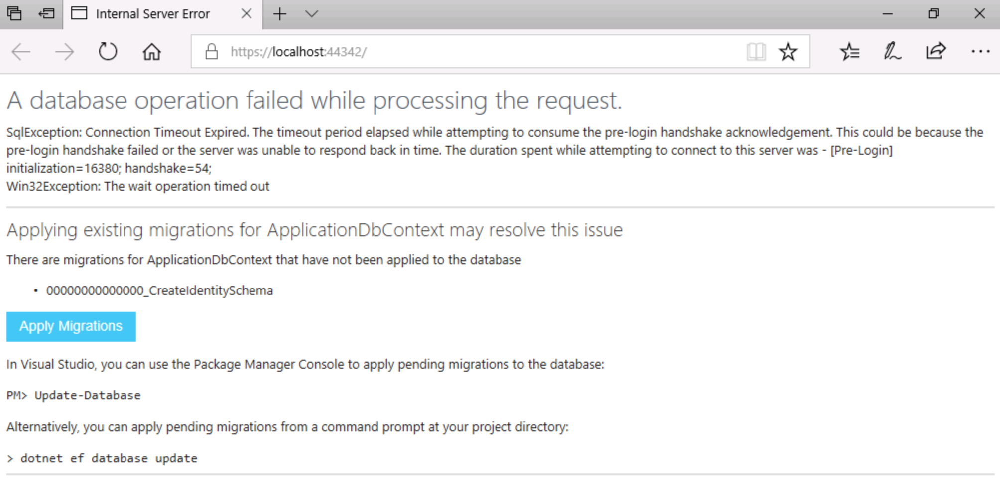

4. When the migrations have been applied, refresh the browser. The new web application should be displayed in the browser as shown below.
        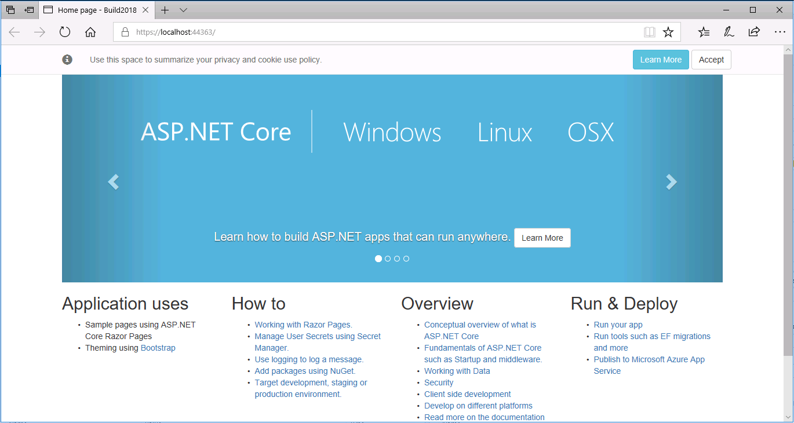
    
    5. Close the browser and stop application in Visual Studio.

<a name="Exercise2" ></a>
### Exercise 2: Working with Razor Pages in ASP.NET Core ###

1. Create a new basic page
  1. Right-click on the **Pages** directory in the **Solution Explorer** and select **Add** / **Razor Page...**.
      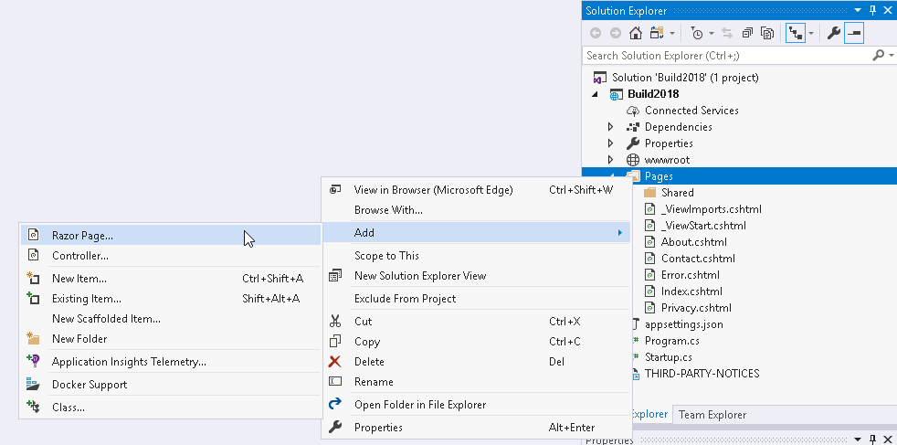
  2. On the resulting dialog, leave **Razor Page** selected and click **Add**.
  3. On the **Add Razor Page** dialog, name the page *CurrentTime* and press the **Add** button.
      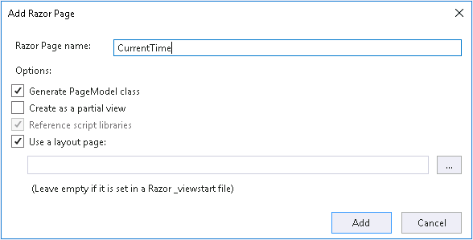
  4. Add a `string Message` property to the `CurrentTime.cshtml.cs` class and initilize it show the current time as shown in the code block below, then save the file:

        ```C#
        namespace Build2018.Pages
        {
            public class CurrentTimeModel : PageModel
            {
                public string Message { get; set; }

                public void OnGet()
                {
                    Message = $"The current time is {System.DateTime.Now}";
                }
            }
        }
        ```

  5. Add the following to the bottom of `CurrentTime.cshtml`:
  
        ```C#
        <p>
            @Model.Message
        </p>
        ```
    
  6. Run the application using **Ctrl-F5** and browse to `/CurrentTime`. You should see a the message displayed as shown below: 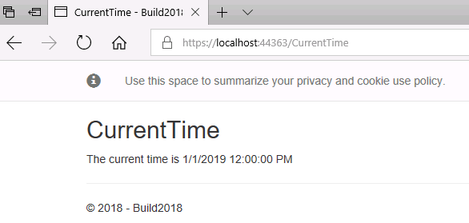
  7. Close the browser and stop the application in Visual Studio.

2. Create a model class (Project: Name, GithubUrl)
    1. Right-click on the project and select **Add** / **Class...**. Name the class `GitHubProject.cs` and click **Add**.
    2. Add an `int ID`, `string Name`, and `string GitHubPage` property to the class as shown below:

        ```C#
        namespace Build2018
        {
            public class GitHubProject
            {
                public int ID { get; set; }
                public string Name { get; set; }
                public string GitHubPage { get; set; }
            }
        }
        ```

3. Scaffold pages for class
    1. Right-click on the **Pages** folder and select **Add** / **New Scaffolded Item...**. Select **Razor Pages using Entity Framework (CRUD)** and press the **Add** button.
    2. Select **GitHubProject** as the Model Class. 
    3. In the **Data Context Class** dropdown, select the existing `ApplicationDbContext` and **Add** button at the bottom of the dialog. When prompted to replace the **Index** and **Index.cshtml.cs** files, select **Yes**.
    4. Running the application will show a message indicating that migrations need to be applied for the newly scaffolded pages as shown below.
        

    5. In Visual Studio, open the **Package Manager** window using the **View** / **Other Windows** / **Package Manager** menu.
    6. In the **Package Manager** windows, type `Add-Migration GitHubProject` and press enter.
    7. When the above command completes, type `Update-Database` and press enter.
    8. Run the application. The home page will now show an empty list of projects. You can add a a project to the list, e.g. `ASP.NET` with project URL `https://github.com/aspnet/home`.
4. Examine the scaffolded pages (instructor will overview).

<a name="Exercise3" ></a>
### Exercise 3: New Features in ASP.NET Core 2.1 ###

In this section, you will learn about some of the top new features for ASP.NET Core 2.1.
1. Overview (instructor will overview new features)
2. HTTPS
    1. In `Startup.cs`, find the `app.UseHttpsRedirection();` command. This call to the HTTPS redirection middleware will automatically redirect HTTP requests to the HTTPS endpoint.
    2. Run the application and modify the URL to change `https` to `http`. Notice that you are automatically redirected back to the HTTPS endpoint.
    3. Right-click on the project and select view the project properties. Select the **Debug** tab. Note that **Enable SSL** is checked.
    4. Expand the **Properties** node in Visual Studio and open the `launchSettings.json` file. This file defines the start URLs for both HTTP and HTTPS.
        
        > Note: You can read more about Improvements for using HTTPS in [this blog post](https://blogs.msdn.microsoft.com/webdev/2018/02/27/asp-net-core-2-1-https-improvements/).

3. Features supporting GDPR compliance

    ASP.NET Core 2.1 includes several features to help you build GDPR compliant web applications. These include HTTPS, Cookie Consent, and Data Control. HTTPS features have been described in the previous section. In this section, we will look at cookie consent and data control features.
    1. Cookie Consent
        1. Run the application and notice the cookie consent dialog at the top of each page.
        
            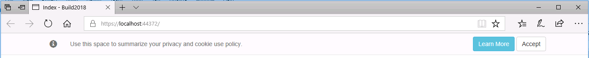
            
        This feature allows you to prompt a user to consent to your application creating “non-essential” cookies. Your application should have a privacy policy and an explanation of what the user is consenting to that conforms to your GDPR requirements. By default, clicking “Learn more” will navigate the user to /Privacy where you could publish the details about your app. This system allows you to write cookie-related code that respects your user's cookie consent choices and the GDPR by specifying whether a cookie is essential (will always be written) or not essential (will only be written if the user has accepted cookies via the cookie consent dialog). The following syntax is used:

        ```C#
        context.Response.Cookies.Append("Test", "Value", new CookieOptions { IsEssential = false });
        ```

        2. Open the file `Pages\Shared\_CookieConsentPartial.cshtml` to view the cookie consent dialog content. You will use this to modify any links to privacy policy, etc.
    2. Data Controls
        1. The GDPR gives users the right to examine the data your application holds on it, edit the data and delete the data entirely from your application. Obviously, we cannot know what data you have, where it lives or how its all linked together but what we do know is what personal data a default ASP.NET Core Identity application holds and how to delete Identity users, so we can give you a starting point. When you create an ASP.NET Core application with Individual Authentication and the data stored in-app you might notice two new options in the user profile page, Download and Delete. 
        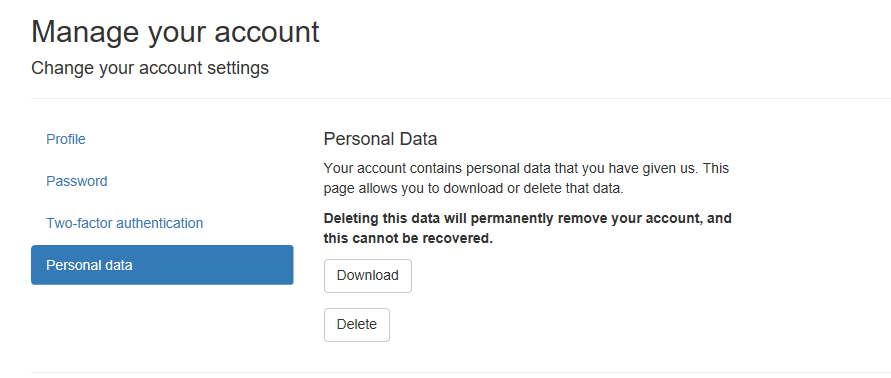

        2. It's best to minimize the individual user data you store in your web applications, but if you have to store personal information about a user it's likely best to do this by storing claims to the application user in ASP.NET Identity. This will automatically be handled by the above data download and deletion features in ASP.NET Core 2.1. 
        > Note: You can read more about GDPR Enhancements in ASP.NET Core 2.1 in [this blog post](https://blogs.msdn.microsoft.com/webdev/2018/03/04/asp-net-core-2-1-0-preview1-gdpr-enhancements/).

4. Identity UI as a library
    Previously, ASP.NET Core Identity included a lot of views (.cshtml files) in the `Pages/Account` directory for account management, as shown below. 

    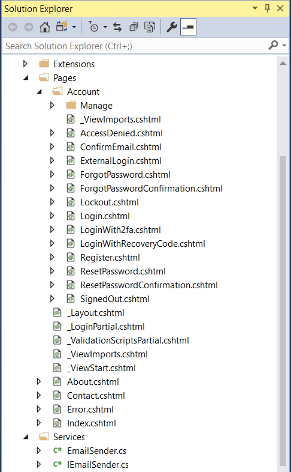
    
    ASP.NET Core 2.1 includes these views in the ASP.NET Core Identity NuGet package, so these views are not required in your project unless you want to customize them. Additionally, this makes it easy to add ASP.NET Identity to your project after project creation.

  1. Right-click on the project and select **Add** / **New Scaffolded Item...** / **Identity** and click the **Add** button. 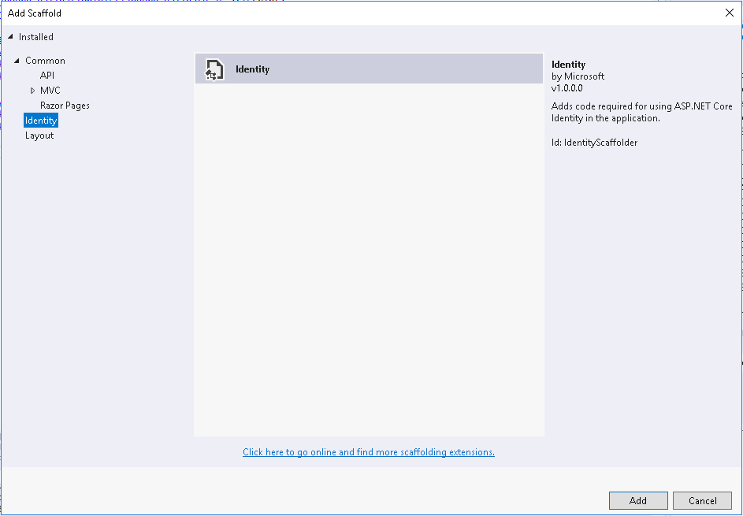

  2. Note that the **Add Identity** dialog allows you to customize the layout page and to select specific files to override. 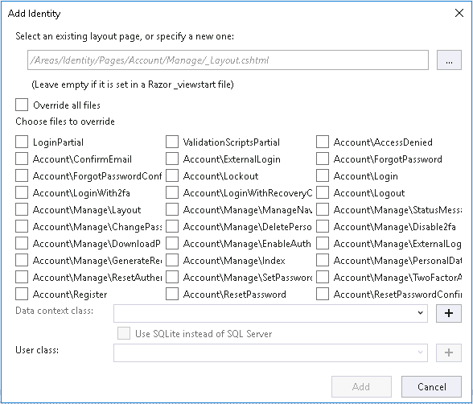
        > Note: There were some bugs with this feature in the version that shipped with this release we're using for the lab at Build, so leave the checkboxes unchecked. The latest release of Visual Studio and ASP.NET Core 2.1 has corrected these issues.

  3. Click **Cancel** on the **Add Identity** dialog.

    > Note: This ability to add user interface pages from a NuGet package is available to .NET developers. To read more about this feature, see this post: [ASP.NET Core 2.1.0-preview1: Razor UI in class libraries](https://blogs.msdn.microsoft.com/webdev/2018/03/01/asp-net-core-2-1-razor-ui-in-class-libraries/).

5. HttpClient Enhancements

    ASP.NET Core 2.1 includes a number of enhancements for HttpClient. In this section, we will be looking at Named and Typed Clients. First we'll look at a Named Client.

    1. Open the `Startup.cs` file and add the following code to the end of the `ConfigureServices()` method:

        ```C#
        services.AddHttpClient("github", c =>
        {
            c.BaseAddress = new Uri("https://api.github.com/");
            c.DefaultRequestHeaders.Add("Accept", "application/vnd.github.v3+json"); // Github API versioning
            c.DefaultRequestHeaders.Add("User-Agent", "HttpClientFactory-Sample"); // Github requires a user-agent
        });
        services.AddHttpClient();
        ```

    2. Add a new Razor Page (using the standard Razor Page template) and name the page `NamedClient`.
    3. Replace the code in `NamedClient.cshtml.cs` with the following:

        ```C#
        namespace Build2018.Pages
        {
            public class NamedClientModel : PageModel
            {
                public string ApiResult { get; set; }
                IHttpClientFactory _httpClientFactory;

                public NamedClientModel (IHttpClientFactory httpClientFactory)
                {
                    _httpClientFactory = httpClientFactory;
                }

                public async Task OnGetAsync()
                {
                    var namedGitHubClient = _httpClientFactory.CreateClient("github");
                    ApiResult = await namedGitHubClient.GetStringAsync("/orgs/dotnet/repos");
                }
            }
        }
        ```

    4. Open `NamedClient.cshtml` and add `@Model.ApiResult` to the end.
    5. Run the application and browse to `/NamedClient`.

    Next we'll looked at a Typed Client. 
    
    1. Add a new class the the project named `GitHubService.cs`. Add the following code:

        ```C#
        using System;
        using System.Net.Http;

        public class GitHubService
        {
            public HttpClient Client { get; private set; }

            public GitHubService(HttpClient client)
            {
                client.BaseAddress = new Uri("https://api.github.com/");
                client.DefaultRequestHeaders.Add("Accept", "application/vnd.github.v3+json"); // Github API versioning
                client.DefaultRequestHeaders.Add("User-Agent", "HttpClientFactory-Sample"); // Github requires a user-agent

                Client = client;
            }
        }
        ```

    2. Next, we'll register this service in `Startup.cs`. Add the following code to the end of the `ConfigureServices()` method:

        ```C#
        services.AddHttpClient<GitHubService>();
        ```
        
    3. Add a new Razor Page to the project named `TypedClient`. 
    4. Replace the code in `TypedClient.cshtml.cs` with the following:
    
        ```C#
        using System.Threading.Tasks;
        using Microsoft.AspNetCore.Mvc.RazorPages;

        namespace Build2018.Pages
        {
            public class TypedClientModel : PageModel
            {
                private GitHubService _ghService;
                public string ApiResult { get; private set; }

                public TypedClientModel(GitHubService ghService)
                {
                    _ghService = ghService;
                }

                public async Task OnGet()
                {
                    ApiResult = await _ghService.Client.GetStringAsync("/repos/aspnet/Home/issues");
                }
            }
        }
        ```
        
    4. Open `TypedClient.cshtml` and add `@Model.ApiResult` to the end.
    5. Run the application and browse to `/TypedClient`.

<a name="Exercise4" ></a>
### Exercise 4: Building Real-time ASP.NET Core applications with SignalR ###

1. If you have time available, complete this [Getting Started With SignalR](https://blogs.msdn.microsoft.com/webdev/2018/02/27/asp-net-core-2-1-0-preview1-getting-started-with-signalr/) tutorial.

    >Note: Rather than installing the SignalR client side library using NPM, you can use this CDN reference:

    ```HTML
    <script src="https://unpkg.com/@@aspnet/signalr@1.0.0-preview2-final/dist/browser/signalr.min.js"></script>`
    ```

  2. Extra extra credit: Call the GitHub API from a `BackgroundService` and pass updates (such as repo follower count) to the UI using a SignalR hub. You can use the following code as a start:

        ```C#
        using GitHubSignalR;
        using Microsoft.AspNetCore.SignalR;
        using Microsoft.Extensions.Hosting;
        using System;
        using System.Threading;
        using System.Threading.Tasks;

        public class GitHubStatsService : BackgroundService
        {
            private readonly IHubContext<GitHubStatsHub> _hubContext;
            private readonly TimeSpan _delay = TimeSpan.FromSeconds(30);
            private GitHubService _ghService;

            public GitHubStatsService(
            IHubContext<GitHubStatsHub> hubContext,
            GitHubService gitHubService)
            {
                _hubContext = hubContext;
                _ghService = gitHubService;
            }

            protected override async Task ExecuteAsync(CancellationToken stoppingToken)
            {
                while (!stoppingToken.IsCancellationRequested)
                {
                    int followers = await GetFollowerCount();
                    await _hubContext.Clients.All.SendAsync("followersUpdated", followers);
                    await Task.Delay(_delay, stoppingToken);
                }
            }

            private async Task<int> GetFollowerCount()
            {
                var result = await _ghService.Client.GetStringAsync("/repos/aspnet/Home/");

                //TODO: Parse JSON data

                return 0;
            }
        }
        ```
